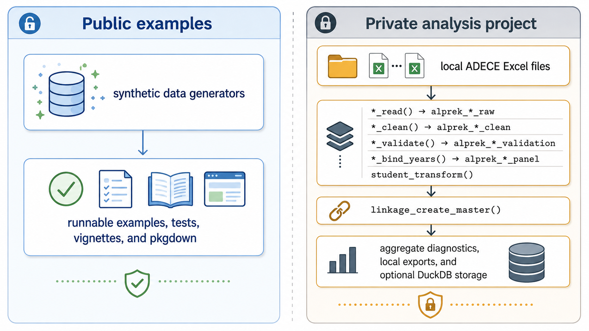

# ALprekDB

<!-- badges: start -->
<!-- badges: end -->

**ALprekDB turns Alabama First Class Pre-K administrative files into
validated, analysis-ready panel datasets while keeping raw data out of
public code.**

ALprekDB is a modular R package for ADECE budget, classroom, and student
records. It handles file-format detection, data-driven codebooks, validation
diagnostics, derived student variables, cross-module linkage, DuckDB storage,
and export helpers. Public examples use fully synthetic data. Real ADECE data
workflows are opt-in, local-only, and designed for private analysis projects.



## Author

JoonHo Lee, Ph.D.<br>
Assistant Professor, The University of Alabama<br>
jlee296@ua.edu

## Why ALprekDB?

ALprekDB is built for repeatable Pre-K administrative data work:

- standardize annual ADECE Excel files across changing source formats;
- build longitudinal budget, classroom, and student panels;
- create classroom- and student-level linked master datasets;
- record validation, linkage, orphan, and coverage diagnostics;
- support SQL-friendly DuckDB outputs for downstream analysis;
- separate public package documentation from private real-data processing.

## Data Coverage in v0.6.0

The v0.6.0 real-data manifest uses asymmetric coverage because the currently
available 2025-26 source set includes classroom and student files, but no
canonical 2025-26 budget file.

| Module | Covered school years | Current release notes |
|--------|----------------------|-----------------------|
| Budget | 2021-22 through 2024-25 | The 2025-26 budget is structurally unavailable and is not inferred, zero-filled, or copied from another source. |
| Classroom | 2021-22 through 2025-26 | Classroom-code validation uses six-digit program codes. |
| Student | 2021-22 through 2025-26 | Student PII is excluded by default in private workflows. |

Aggregate real-data smoke tests currently cover 5,867 budget classroom-year
records, 7,409 classroom-year records, and 116,689 student-year records. These
are aggregate processing counts, not row-level data.

## Installation

```r
# From GitHub
remotes::install_github("joonho112/ALprekDB")
```

## Quick Start: Synthetic Data

Synthetic examples require no ADECE files and are safe for public
documentation, CI checks, teaching, and package development. They use fake
`9xx` classroom-code prefixes and synthetic county labels so printed examples
cannot be mistaken for confidential ADECE records.

```r
library(ALprekDB)

budget <- alprek_synthetic_budget(
  n_classrooms = 20,
  n_years = 2,
  seed = 42
)

classroom <- alprek_synthetic_classroom(
  n_classrooms = 20,
  n_years = 2,
  seed = 42
)

student <- alprek_synthetic_student(
  n_students = 100,
  n_classrooms = 20,
  n_years = 2,
  seed = 42
)

master <- linkage_create_master(budget, classroom, student)
linkage_validate(master)
linkage_summary_stats(master)
```

## Private Real-Data Workflow

Raw ADECE files are not distributed with ALprekDB and should not be committed
to GitHub, included in package builds, or rendered into public pkgdown pages.
For private processing, keep raw files in a local source directory such as
`ORIGINAL-DATA/` or another directory referenced by `ALPREKDB_DATA_DIR`.

The package includes a `targets` workflow template:

```r
template_dir <- system.file("templates", "targets", package = "ALprekDB")

dir.create("alprekdb-private-workflow", showWarnings = FALSE)
file.copy(
  list.files(template_dir, full.names = TRUE, all.files = TRUE, no.. = TRUE),
  "alprekdb-private-workflow",
  recursive = TRUE
)
```

From the private workflow directory, configure paths with environment
variables:

```sh
export ALPREKDB_RUN_REALDATA=1
export ALPREKDB_DATA_DIR="/path/to/local/ADECE/source/files"
export ALPREKDB_OUTPUT_DIR="output/alprekdb"
```

Then run:

```r
targets::tar_make()
```

The private workflow keeps student PII out of processed student panels by
default. Row-level RDS outputs and DuckDB writes require an explicit local
opt-in:

```sh
export ALPREKDB_WRITE_OUTPUTS=1
```

## Modules

| Module | Purpose | Main outputs |
|--------|---------|--------------|
| Budget | Read, clean, validate, reshape, and bind per-classroom funding records. | Long budget records and multi-year budget panels. |
| Classroom | Read, clean, validate, and bind classroom characteristics, geography, and staffing records. | Multi-year classroom panels. |
| Student | Read, clean, validate, and bind child-level enrollment, demographics, assessment, attendance, and service records. | Multi-year student panels with PII excluded by default. |
| Transform | Derive analytic student measures such as gains, readiness, chronic absence, and risk indicators. | Enriched student panels. |
| Linkage | Join budget, classroom, and student panels with explicit orphan and coverage diagnostics. | Classroom-level and student-level master datasets. |
| Database | Persist panels and master datasets in DuckDB for SQL analysis. | Local DuckDB databases and query results. |

## Pipeline Architecture

```text
Public examples
  synthetic data generators
        |
        v
  runnable examples, tests, vignettes, and pkgdown

Private analysis project
  local ADECE Excel files
        |
        v
  *_read()        -> alprek_*_raw
  *_clean()       -> alprek_*_clean
  *_validate()    -> alprek_*_validation
  *_bind_years()  -> alprek_*_panel
  student_transform()
        |
        v
  linkage_create_master()
        |
        v
  aggregate diagnostics, local exports, and optional DuckDB storage
```

## Privacy and Provenance Guardrails

- Do not commit raw ADECE files, `_targets/` caches, row-level exports, local
  DuckDB databases, or private output folders.
- Use `alprek_synthetic_budget()`, `alprek_synthetic_classroom()`, and
  `alprek_synthetic_student()` for public examples; these generators use fake
  `9xx` classroom-code prefixes and synthetic county labels.
- Treat all real student-level outputs as confidential, even when direct PII
  columns are excluded.
- Keep real-data paths in environment variables rather than committed scripts.
- Report only aggregate diagnostics, validation summaries, and non-disclosive
  counts in public documentation.
- Preserve package version, source manifest coverage, validation summaries, and
  linkage diagnostics with private analytic outputs.

## Vignettes

### Applied Track

- [A1 - Getting started](articles/a1-getting-started.html)
- [A2 - Build panels](articles/a2-build-panels.html)
- [A3 - Linkage analysis](articles/a3-linkage-analysis.html)
- [A4 - DuckDB and SQL](articles/a4-duckdb-sql.html)
- [A5 - Targets workflow](articles/a5-targets-workflow.html)

### Methodological Track

- [M1 - Architecture trilemma](articles/m1-architecture-trilemma.html)
- [M2 - Validation framework](articles/m2-validation-framework.html)
- [M3 - Codebooks and mappings](articles/m3-codebooks-mappings.html)
- [M4 - Privacy and provenance](articles/m4-privacy-provenance.html)

## Classroom Code Format

Every classroom record is identified by a classroom code:
`CCCDNNNNNN.NN`

- `CCC` = county code, such as `001` through `067`;
- `D` = delivery type;
- `NNNNNN` = six-digit program code;
- `NN` = classroom number within site.

The example below uses fake `9xx` prefixes and `9xxxxx` program codes for
public documentation.

```r
parse_classroom_codes(c("901P900001.01", "967H900002.02"))
```

Delivery type codes are defined by `alprek_delivery_types()`:

| Code | Delivery type |
|------|---------------|
| `P` | Public School |
| `C` | Private Child Care |
| `H` | Head Start |
| `O` | Community Organization |
| `F` | Faith-Based Organization |
| `U` | University Operated |
| `S` | Private School |

## Known Limitations

- ALprekDB does not distribute or expose raw ADECE row-level records.
- Synthetic data are fabricated for demonstration and testing; they should not
  be interpreted as Alabama program estimates.
- The 2025-26 budget file is not available in the current source scope, so
  2025-26 classroom and student records are retained with explicit missing
  budget coverage.
- Validation checks are advisory diagnostics, not a substitute for substantive
  review of analysis choices.
- Real-data processing depends on local file access and the canonical source
  manifest; paths and outputs should remain outside public repositories.

## License

MIT
